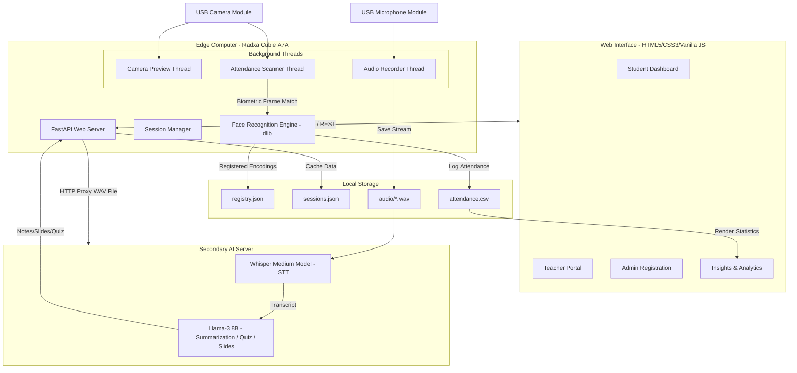

# 🎓 CogniClass

An autonomous, edge-computing classroom monitoring and lecture intelligence system. Designed for the **Radxa Cubie A7A** single-board computer, **CogniClass** automates administrative chores (hands-free face-recognition attendance) and enhances student learning resources (AI-generated lecture notes, slides, and quizzes).

By executing lightweight inference on the edge and proxying heavy GPU-bound workloads to a local secondary server, **CogniClass** offers an offline-capable, cost-effective smart classroom hub with absolute biometric data privacy.

---

## 📺 Project Demo Video
👉 **[Watch the System Demo on YouTube](https://youtu.be/sQapDEO9rCs?si=0QqsEi57405Jv_r0)**

---

## 🚀 Key Features

* **Biometric Attendance Tracking (dlib ResNet):** Automatically logs student attendance using a 1080p camera feed, matching face templates against a local database within 1.5 seconds.
* **Hands-Free Lecture Recording:** A non-intrusive boundary microphone captures class lectures asynchronously using a lightweight recording thread.
* **Whisper Transcription & Llama-3 NLP:** Transcribes speech to text and restructures raw transcripts into structured markdown summaries, topic-wise presentation outlines, and self-assessment quizzes.
* **4-in-1 Glassmorphic UI:** A responsive Single Page Application (SPA) with a premium glassmorphic dark-mode design:
  1. **Student Dashboard:** Access transcripts, download notes, study slides, and take quizzes.
  2. **Teacher Portal:** Active session controllers, hardware monitors, and real-time scanned attendance list.
  3. **Admin Face Registration:** Enroll new students, capture training frames, and manage the biometric gallery.
  4. **Insights & Analytics:** Interactive visual charts mapping attendance health (Chart.js) and alerts for students below the 75% threshold.
* **Edge-Offload Model:** Offloads resource-heavy GPU-bound AI processing to a local LAN computer, allowing the Radxa board to maintain stable performance without overheating.

---

## 🛠️ System Architecture

GitHub natively renders the system diagram below showing how the components interact:



---

## 📦 Directory Structure

```filepath
├── templates/
│   └── index.html             # Glassmorphic single-page web application
├── server.py                  # Core FastAPI application & API endpoints
├── mainui.py                  # Desktop application wrapper/entry point
├── attend.py                  # Background camera thread & face recognition helper
├── ai_module.py               # Llama-3 prompt builder & content parser
├── audio_module.py            # Local sounddevice microphone controller
├── transcribe_module.py       # Proxy router sending WAV files to GPU server
├── .gitignore
└── README.md
```

---

## 💻 Tech Stack & Requirements

### Hardware Specs
* **Classroom Unit:** Radxa Cubie A7A (or Rockchip RK3588S counterpart), 4GB RAM, 32GB MicroSD, 1080p Wide-Angle USB Camera, USB Microphone.
* **Inference Server (Local LAN):** Laptop/PC with an NVIDIA Dedicated GPU (RTX 3060 or higher with 6GB+ VRAM).

### Software Requirements
* **Operating Systems:** Ubuntu Server/Debian (ARM64) for Radxa; Windows 10/11 or Ubuntu Desktop (x86_64) with CUDA enabled for the AI server.
* **Backend:** Python 3.10+
* **Frontend:** HTML5, CSS3, Vanilla ES6 JavaScript, Chart.js, Tailwind CSS (optional).
* **Python Dependencies:** `fastapi`, `uvicorn`, `dlib`, `face_recognition`, `sounddevice`, `pypdf`, `requests`, `numpy`, `opencv-python`.

---

## 🚀 Setup & Installation

### 1. Clone the Repository
```bash
git clone https://github.com/gouravpradhan/smart-classroom-dashboard.git
cd smart-classroom-dashboard
```

### 2. Install Dependencies
Ensure you have the required build tools for compile-heavy libraries (like `dlib`):

**On Debian/Ubuntu (Radxa):**
```bash
sudo apt-get update
sudo apt-get install build-essential cmake g++ gfortran libgraphicsmagick1-dev libjpeg-dev libpng-dev liblapack-dev libblas-dev
pip install -r requirements.txt
```
*(Make sure `requirements.txt` includes: fastapi, uvicorn, dlib, face_recognition, sounddevice, soundfile, numpy, opencv-python, requests)*

### 3. Setup the Biometric Database
On the first run, launch the Admin Portal from the dashboard and capture 20 frames per student to initialize `registry.json`.

### 4. Start the Edge Server
Run the FastAPI web server on the Radxa Board:
```bash
python server.py
```
By default, the server will host the dashboard at `http://localhost:8000`.

### 5. Start the Secondary AI Server
Make sure your secondary server is running on the same network and change the API proxy URL inside `transcribe_module.py` to point to your GPU server's LAN IP address.

---

## 🛡️ Privacy & Biometrics Security
To comply with student data privacy regulations:
1. The system **does not store raw facial images** of students in the local directory.
2. During registration, faces are immediately translated into **128-dimensional floating-point vector hashes**.
3. All verification calculations occur on-device using local Euclidean distance comparisons.
